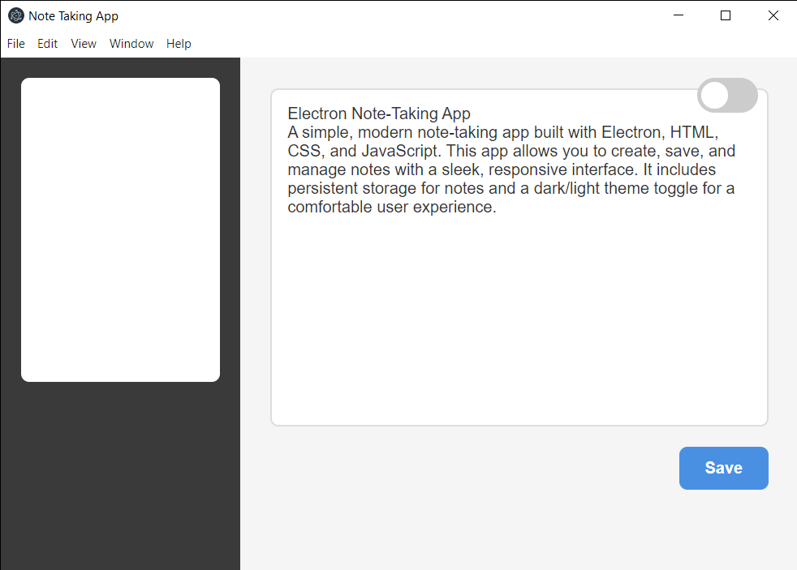
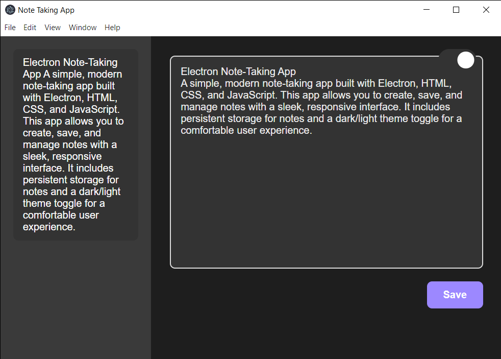

# Electron Note-Taking App

A simple, modern note-taking app built with Electron, HTML, CSS, and JavaScript. This app allows you to create, save, and manage notes with a sleek, responsive interface. It includes persistent storage for notes and a dark/light theme toggle for a comfortable user experience.

## Features

- **Persistent Note Storage**: Notes are stored in a JSON file, ensuring they’re saved across app restarts.
- **Minimalist UI**: Clean, easy-to-use interface with a sidebar for note navigation.
- **Dark/Light Theme**: Toggle between dark and light modes to suit your preferences.
- **Responsive Design**: Optimized for various screen sizes; sidebar hides on smaller screens.
- **Animations and Hover Effects**: Interactive elements for a more engaging experience.

## Screenshots




## Getting Started

Follow these instructions to set up and run the Electron Note-Taking App on your local machine.

### Prerequisites

- [Node.js](https://nodejs.org) (v16 or higher recommended)
- [npm](https://www.npmjs.com/) (comes with Node.js) or [yarn](https://yarnpkg.com/)

### Installation

1. **Clone the Repository**:
   ```bash
   git clone https://github.com/your-username/electron-note-app.git
   cd electron-note-app
   ```

2. **Install Dependencies**:
   ```bash
   npm install
   ```

3. **Run the App**:
   ```bash
   npm start
   ```

### Directory Structure

```
electron-note-app/
├── src/
│   ├── main.js         // Main process for Electron
│   ├── index.html      // HTML layout
│   ├── renderer.js     // Renderer process and UI handling
│   └── notes.json      // JSON file for storing notes
├── package.json        // Project configuration and dependencies
└── node_modules/       // Installed dependencies
```

## Usage

1. **Add a New Note**: Type your note in the text area and click "Save".
2. **View Notes**: Saved notes will appear in the sidebar. Click on any note to load it in the editor.
3. **Toggle Dark/Light Theme**: Click the theme icon at the top right to switch between dark and light modes.

## Customization

You can adjust styling, storage methods, and add more features such as:
- **Enhanced Note Editing**: Add features like rich text formatting.
- **Cloud Storage Integration**: Sync notes with cloud storage services.
- **Additional Themes**: Experiment with different color schemes in the CSS.

## Built With

- [Electron](https://electronjs.org/) - Framework for building cross-platform desktop apps with JavaScript.
- HTML, CSS, JavaScript - Frontend components.

## License

This project is licensed under the MIT License.